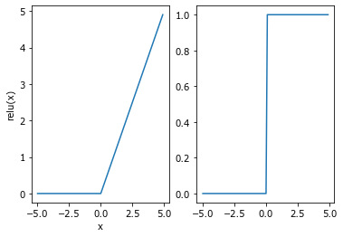
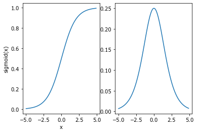

<iframe style="border-radius:12px" src="https://open.spotify.com/embed/track/3oqElcCtP4UjIEWDdNHK9t?utm_source=generator" width="100%" height="380" frameBorder="0" allowfullscreen="" allow="autoplay; clipboard-write; encrypted-media; fullscreen; picture-in-picture"></iframe>

## 常见的激活函数


```python
%matplotlib inline
import torch
import matplotlib.pyplot as plt
```


```python
#ReLU
plt.figure(1)
ax1=plt.subplot(1,2,1)
x1=torch.arange(-5,5,0.1,requires_grad=True)
y1=torch.relu(x1)
plt.plot(x1.detach().numpy(),y1.detach().numpy())
plt.xlabel('x')
plt.ylabel('relu(x)')
ax1=plt.subplot(1,2,2)
y1.backward(torch.ones_like(x1), retain_graph=True)
plt.plot(x1.detach().numpy(),x1.grad)
```


    [<matplotlib.lines.Line2D at 0x2475d1f7bb0>]


    

    


```python
#sigmoid
plt.figure(1)
ax1=plt.subplot(1,2,1)
x1=torch.arange(-5,5,0.1,requires_grad=True)
y1=torch.sigmoid(x1)
plt.plot(x1.detach().numpy(),y1.detach().numpy())
plt.xlabel('x')
plt.ylabel('sigmoid(x)')
ax1=plt.subplot(1,2,2)
y1.backward(torch.ones_like(x1), retain_graph=True)
plt.plot(x1.detach().numpy(),x1.grad)
```


    [<matplotlib.lines.Line2D at 0x2475d2b7b80>]


    

    


```python
#导入包并加载数据

%matplotlib inline
import torch
import numpy as np
import torchvision
from torch.utils import data
from torchvision import transforms

# 通过ToTensor实例将图像数据从PIL类型变换成32位浮点数格式，
# 并除以255使得所有像素的数值均在0到1之间
trans = transforms.ToTensor()
mnist_train = torchvision.datasets.FashionMNIST(
root="../data", train=True, transform=trans, download=True)
mnist_test = torchvision.datasets.FashionMNIST(
root="../data", train=False, transform=trans, download=False)

#数据读取
batch_size = 256
def get_dataloader_workers(): 
#"""使⽤4个进程来读取数据"""
    return 4
train_iter = data.DataLoader(mnist_train, batch_size, shuffle=True,
num_workers=get_dataloader_workers())
test_iter = data.DataLoader(mnist_test, batch_size, shuffle=False,
num_workers=get_dataloader_workers())

#网络设计
from torch import nn
net=nn.Sequential(nn.Flatten(),nn.Linear(784,512),nn.ReLU(),nn.Linear(512,256),nn.ReLU(),nn.Linear(256,10))

#参数初始化
def init_weight(m):
    if type(m) == nn.Linear:
        nn.init.normal_(m.weight, std=0.01)
net.apply(init_weight)

#softmax与交叉熵结合
loss = nn.CrossEntropyLoss(reduction='mean')
sgd = torch.optim.SGD(net.parameters(), lr=0.1)


def accuracy(y_hat, y):
#"""计算预测正确的数量"""
    if len(y_hat.shape) > 1 and y_hat.shape[1] > 1:
        y_hat = y_hat.argmax(axis=1)
    cmp = y_hat.type(y.dtype) == y
    return float(cmp.type(y.dtype).sum())
class Accumulator: 
#"""在n个变量上累加"""
    def __init__(self, n):
        self.data = [0.0] * n
    def add(self, *args):
        self.data = [a + float(b) for a, b in zip(self.data, args)]
    def reset(self):
        self.data = [0.0] * len(self.data)
    def __getitem__(self, idx):
        return self.data[idx]

def evaluate_accuracy(net, data_iter): 
#"""计算在指定数据集上模型的精度"""
    if isinstance(net, torch.nn.Module):
        net.eval() # 将模型设置为评估模式
    metric = Accumulator(2) # 正确预测数、预测总数
    with torch.no_grad():
        for X, y in data_iter:
            metric.add(accuracy(net(X), y), y.numel())
    return metric[0] / metric[1]
```


```python
num_epochs=30
for epoch in range(num_epochs):
    for X,y in train_iter:
        y_hat=net(X)
        l=loss(y_hat,y)
        sgd.zero_grad()
        l.backward()
        sgd.step()

print(evaluate_accuracy(net, train_iter))
print(evaluate_accuracy(net, test_iter))
```

    0.8968333333333334
    0.867
    
